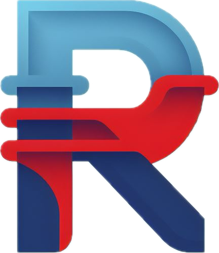

<div align="center">
  
  <h1><strong>Ronit Anandani</strong></h1>
</div>

This is the repository for my portfolio website, built using [Next.js](https://nextjs.org/). Please reference the [development](#dev) section for more information on the framework and how to run this repository.

Many of the site's features are custom-coded, but I also use the following libraries to enhance the visual aesthetic of the site

- [Animate.css](https://animate.style/)
- [Animate On Scroll Library](https://michalsnik.github.io/aos/)
- [social-logos](https://github.com/Automattic/social-logos)


---


## <a name="dev"></a> Development Info

This is a [Next.js](https://nextjs.org/) project bootstrapped with [`create-next-app`](https://github.com/vercel/next.js/tree/canary/packages/create-next-app).

### Getting Started

First, run the development server:

```bash
npm run dev
# or
yarn dev
# or
pnpm dev
```

Open [http://localhost:3000](http://localhost:3000) with your browser to see the result.

You can start editing the page by modifying `app/page.tsx`. The page auto-updates as you edit the file.

This project uses [`next/font`](https://nextjs.org/docs/basic-features/font-optimization) to automatically optimize and load Inter, a custom Google Font.

### Learn More

To learn more about Next.js, take a look at the following resources:

- [Next.js Documentation](https://nextjs.org/docs) - learn about Next.js features and API.
- [Learn Next.js](https://nextjs.org/learn) - an interactive Next.js tutorial.

You can check out [the Next.js GitHub repository](https://github.com/vercel/next.js/) - your feedback and contributions are welcome!
